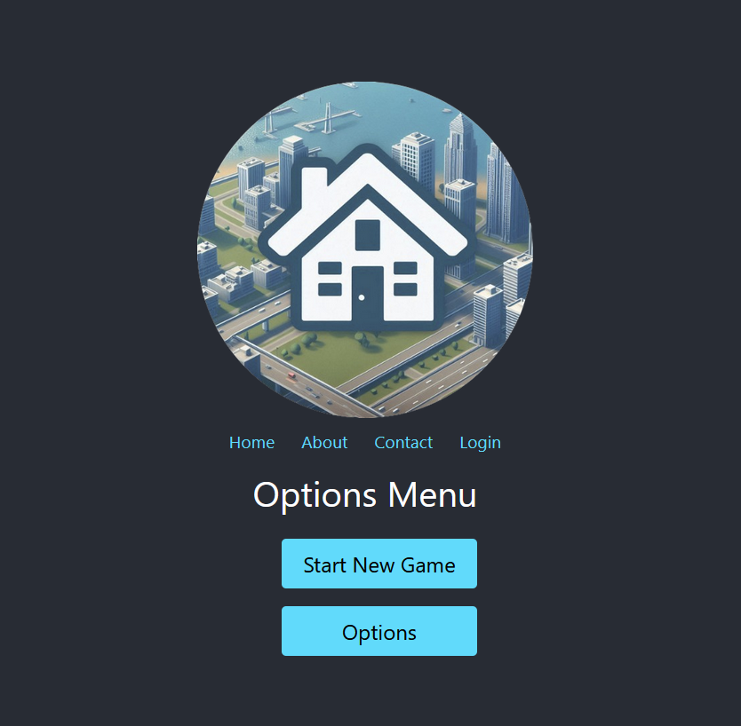

# City Builder Game (Not working yet)

Welkom bij **City Builder Game**, een browsergebaseerde game waarmee je een stad kunt bouwen en beheren. Dit project
maakt gebruik van React voor de frontend, Node.js voor de backend, en bevat een eenvoudig grid-systeem voor het
ontwerpen van je stad.

  <!-- Voeg een screenshot van je game toe -->

## Functionaliteit

### Inloggen

- **Login Pagina**: Gebruikers kunnen inloggen met hun gebruikersnaam en wachtwoord.
- **Inlogcontrole**: Na succesvolle inlogin worden gebruikers doorgestuurd naar de homepagina.

### Homepagina

- **Optiemenu**: Afhankelijk van de aanwezigheid van een opgeslagen game, worden gebruikers de keuze gegeven om een
  nieuwe game te starten of een bestaande game te laden.
- **Game Grid**: Het game canvas toont een groen vierkant met een 24x24 grid, dat kan worden gebruikt om de stad te
  ontwerpen.

### Game Canvas

- **Grid Systeem**: Het canvas is verdeeld in een grid van 24x24 cellen met stippellijnen. Dit biedt een visueel raster
  voor het plannen en bouwen van je stad.
- **Zoom en Pan**: (Voeg hier eventuele informatie toe als je deze functionaliteit toevoegt)

## Installatie

Volg deze stappen om het project lokaal te draaien:

1. **Clone de repository:**

   ```bash
   git clone https://github.com/yourusername/city-builder-game.git
   cd city-builder-game
